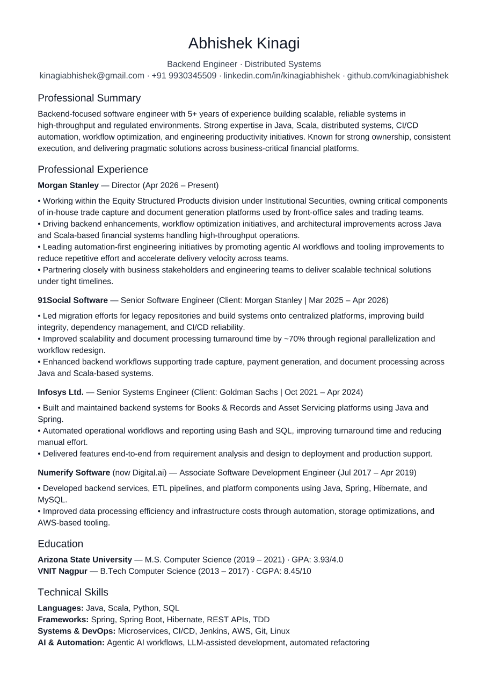

<h1 align="center">
  <a href="https://git.io/typing-svg">
    
  </a>
</h1>

<p align="center">
  
</p>

<p align="center">
  <b>Director P3 @ Morgan Stanley</b> • Equity Structured Products (IST) • MS in CS (ASU)
</p>

<p align="center">
  <a href="https://kinagiabhishek.github.io/kinagiabhishek/" target="_blank">
    
  </a>
  <a href="https://www.linkedin.com/in/kinagiabhishek/" target="_blank">
    
  </a>
  <a href="https://leetcode.com/u/kinagiabhishek/" target="_blank">
    
  </a>
  <a href="https://github.com/kinagiabhishek/code-lab">
    
  </a>
</p>

---

### 💻 Executive Overview

```yaml
name: Abhishek Kinagi
role: Director P3
company: Morgan Stanley (Institutional Securities Technology - IST)
division: Equity Structured Products (Trade Capture & Document Generation Platforms)
education:
  - MS in Computer Science, Arizona State University (ASU)
  - BTech in Computer Science & Engineering, VNIT Nagpur
prior_experience:
  - Technology Analyst @ Goldman Sachs (PWM Books & Records)
  - Associate Software Developer @ Numerify (ETL & Spark ML Platform)
technical_stack: Java, Scala, Python, Sybase SQL, AWS Redshift, Selenium, Bash
mindset: Agentic AI-First, Automation-First, High Throughput, Rapid Execution
```

---

### 💼 Career Snapshot

- 🏦 **Morgan Stanley (Director P3 - Equity Structured Products)**:
  - Engineering high-throughput trade capture & document generation engines in **Java and Scala**.
  - Driving migration of legacy repositories onto centralized build platforms for enhanced CI/CD reliability.
  - Championing **agentic AI workflows** (`agy`) and automation-first engineering across teams.
- 🏛️ **Goldman Sachs (Technology Analyst - Private Wealth Management)**:
  - Developed Books & Records & Asset Servicing applications in Java, Sybase SQL, and Bash.
  - Automated software support framework, reducing manual intervention by **25%** and boosting DB scan speed by **40%**.
- 📊 **Numerify (Associate Software Developer - Platform)**:
  - Built BI Application Modeler & automated ETL data pipelines on AWS Redshift with Z-Standard compression.
  - Provisioned Spark Machine Learning training/execution platform for client data prediction metrics.

---

### 🧮 LeetCode Metrics

<p align="center">
  <a href="https://leetcode.com/u/kinagiabhishek/">
    
    
    
    
  </a>
</p>

---

### 🌟 Monorepo Spotlight

<table>
  <tr>
    <td width="100%">
      <h3 align="center">⚡ <a href="https://github.com/kinagiabhishek/code-lab">code-lab</a></h3>
      <p align="center"><i>Primary monorepo consolidating 58 100% handcrafted & verified Java algorithms, data structures, and automation scripts.</i></p>
      <ul>
        <li><b>🧮 58 Verified Data Structures & Algos Suite</b>: 100% fully implemented Java suite with Line-1 Official Links covering <b>Trees, Graphs, Stacks/Queues, Linked Lists, Heaps, Backtracking, DP, Sliding Window, Binary Search, & Bit Manipulation</b> (<a href="https://github.com/kinagiabhishek/code-lab/tree/master/ds-algo/java">Core Java DS</a> • <a href="https://github.com/kinagiabhishek/code-lab/tree/master/ds-algo/leetcode-practice/java">Java LeetCode Suite</a>)</li>
        <li><b>🤖 Automations</b>: Selenium & Playwright browser scripts (<a href="https://github.com/kinagiabhishek/code-lab/tree/master/automations/resume-uploader">Resume Uploader</a>)</li>
        <li><b>🐍 Python Solvers</b>: Logical constraint resolution tools (<a href="https://github.com/kinagiabhishek/code-lab/tree/master/scripts/verity-solver">Verity Solver</a>)</li>
      </ul>
    </td>
  </tr>
</table>

---

### 📊 GitHub Analytics

<p align="center">
  
  &nbsp;&nbsp;
  
</p>

---

<p align="center">
  🌐 <b>Portfolio</b>: <a href="https://kinagiabhishek.github.io/kinagiabhishek/">kinagiabhishek.github.io</a> • 
  💼 <b>LinkedIn</b>: <a href="https://www.linkedin.com/in/kinagiabhishek/">kinagiabhishek</a> • 
  🧮 <b>LeetCode</b>: <a href="https://leetcode.com/u/kinagiabhishek/">kinagiabhishek</a> • 
  📧 <b>Email</b>: <a href="mailto:kinagiabhishek@gmail.com">kinagiabhishek@gmail.com</a>
</p>
